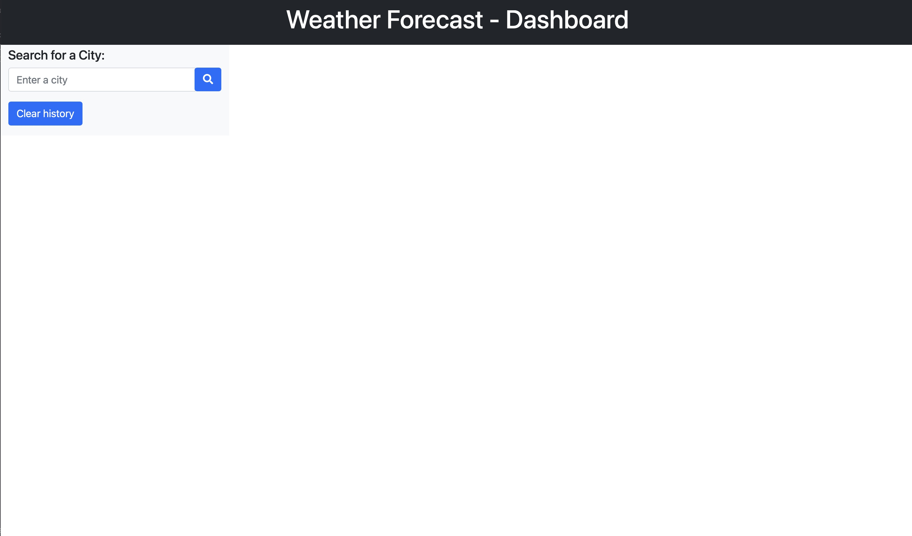
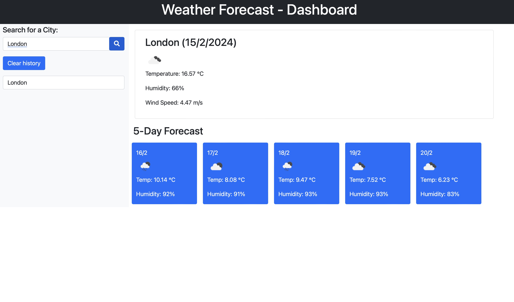
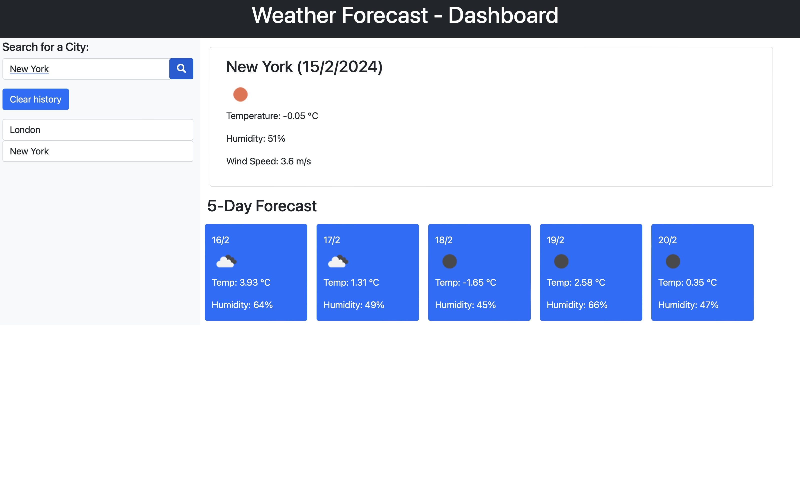

# Module 8 - Weather Dashbaord

This module has been a real pain for me over the last few weeks. I have totally over thought the direction I wanted to go with this. It has had multiple repos created and deleted, as I wasn't happy with the structure of the HTML and the overall application.

In the end I have gone with a basic layout and basic colours.

## Resources

These are some of the resources I used for the challenge.

I have read a fair few pages over the last few weeeks and these are some of the pages I have used for reference.

https://developer.mozilla.org/en-US/

https://www.w3schools.com/

https://stackoverflow.com/ 

I have watched a few Youtube video / tutorals but they all sent me down a rabbit hole that didn't help, so I will not include the links.

## Links to Application
https://github.com/iamdanjoyce/module-eight-weather

https://iamdanjoyce.github.io/module-eight-weather

## Screenshots of Application Live

